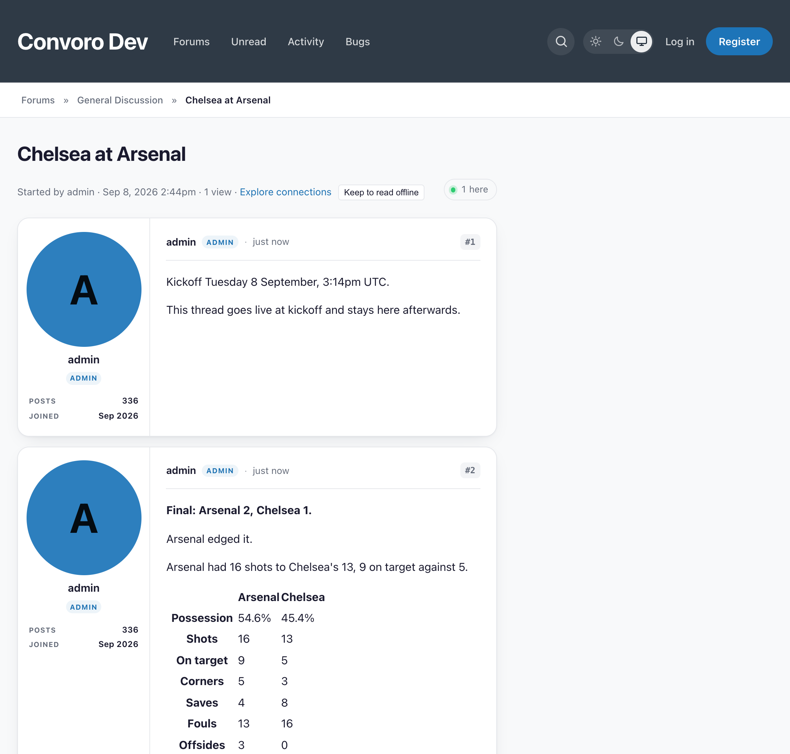

# Game Day

A thread for every game, opened before kickoff and finished with a recap that
says how the game was won. For [Convoro](https://convoro.co).



Third-party extension by Ernest Defoe. Requires
[Picks](https://github.com/ernestdefoe/convoro-fbsfb-picks) for the fixtures and
box scores — Game Day reaches no provider itself, because one place is what
makes a call budget enforceable.

## What it does

**Opens a thread before kickoff.** An ordinary topic, in the home team's forum,
three hours out by default. Ordinary is the point: it is quotable, searchable,
moderatable, and still there if this extension is removed.

**Goes live at kickoff and stops being live afterwards**, using Convoro's own
live-topic state.

**Finishes it with a recap.** Posted the moment a game settles and rewritten in
place when the box score arrives — the provider publishes statistics minutes to
hours after the final whistle, and waiting would delay the one thing everybody
in the thread is waiting for. A game the provider never covered simply keeps the
score.

Everything below the score is earned. A yardage line is only printed when the
two are far enough apart to mean something; a turnover line only when somebody
actually lost the ball; a comparison row only when at least one side has the
figure. A recap that always has three sentences has three sentences of nothing
on the day nothing happened.

## More than one sport

The recap's *structure* is fixed — a score, a result, a sentence on how it went,
the players worth naming, a comparison — and its *words* come from the sport.

| Sport | What a recap talks about |
|---|---|
| American football | Yards, turnovers, third down, a quarterback's line |
| Football (soccer) | Shots, possession, corners, cards; a draw is an ordinary result |
| Basketball | Shooting percentages, the three-point line, a triple-double |
| Baseball | Hits against runs, home runs, a pitcher's innings and earned runs |
| Ice hockey | Shots, the power play, a goaltender's saves and a shutout |

🚨 **The thresholds belong to the sport, not to the recap.** Forty yards is
nothing in football and a two-goal swing is most of a football match; three
points is a rout in gridiron and a coin toss in basketball. Putting those
numbers in one place would mean one sport always reading wrongly.

🚨 **Football names no players**, and that is the honest answer rather than an
unfinished one. ESPN's match summary carries team statistics and nothing else —
naming a scorer means reading the goal events, a different feed. Declaring a
category that is always empty would put a heading over nothing under every
match.

Which sport a game is described in comes from **its season's league** in Picks,
so a board following the NFL and the Premier League gets both right on the same
Sunday. **Admin → Game Day → Sport** is the fallback, for a season created
before leagues existed.

Adding a league is a class implementing `Services\Sports\Sport` and one line in
`Services\Sports\Sports` — an application can register its own without editing a
file it does not own.

## Tests

```bash
php tests/run.php     # via the Convoro test runner
```

The suite asserts the **words**, not the structure: "the document has six nodes"
would pass for a recap that said something wrong in all six of them. The box
scores are real — CollegeFootballData's own answer for Notre Dame 41, Wisconsin
13, and captured ESPN responses for the NBA, MLB, the NHL and the Premier
League. The same assertions run on the Flarum build of Game Day, which is how
the two are kept saying the same things.

## Licence

MIT.
